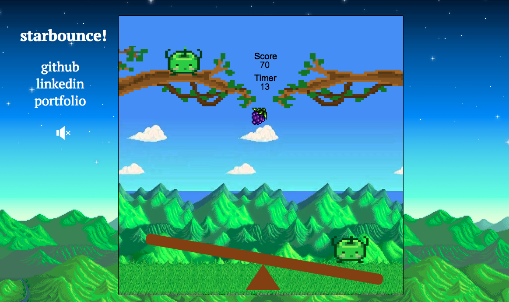

# StarBounce

[Live](https://claireskim.com/StarBounce/)

## Look and Feel
StarBounce is a game of survival. The forest spirits are wildly unequipped for the winter and must forage as many berries as possible lest they starve to death.

At the bottom of the screen is a seesaw utilized by the forest spirits to 'bounce' from the seesaw back onto
their designated spots on platform. In the middle of the screen, between the seesaw and the platform, are berries that speed across
the screen horizontally. The objective of the game is to grab as many berries as possible by bouncing the forest spirits from the seesaw back onto
the platform in under a minute. The rules are as such:

1. If you hit anything that is not a berry - trash, you lose 10 seconds.
2. If you successfully hit a berry - you get 10 points.

If by the end of the minute, you have not been able to accumulate over 100 points, you have failed your mission.

## Gameplay
The A-S-D keys are used to navigate the forest spirits back and forth.

* S used to toggle the jump
* A to move left
* D to move right

## Functionality

With StarBounce users are able to:
* Toggle sound on/off
* Keep track of score
* Save the forest spirits from complete extinction

## Architecture and Technologies

This project was implemented with the following technologies:

* JavaScript for game logic
* Canvas with HTML5
